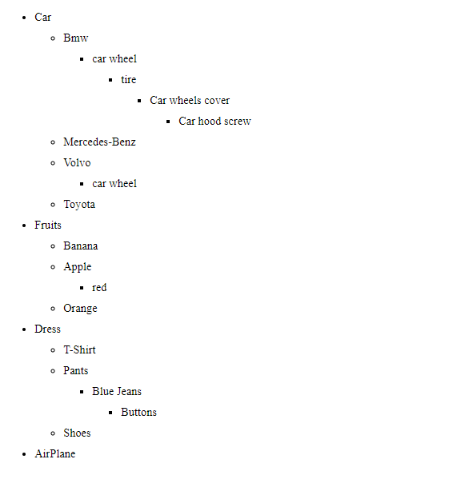

# show-data-as-tree-view
 > show data as tree view (from database " mysql ")

## about the project

:orange_circle: 
this project help you to can show data as branch of tree.
in across web you can find like this project but It may not be what you want!
in other projects work on associative array where data already exist but in this project data already doesn't exist and with query, data find.
if the parent has a child, it prints its children, and if there is no child, it goes to the next parent and continues the same process until there are no children left.

__:small_orange_diamond:The table(category) we use:__

|id|title|catid|
|:-:|:---:|:--:|
| 1 | car |  0 |
| 2 |Fruits|  0 |
| 3 |Dress|  0 |
| 4 |T-Shirt|  3 |
| 5 |Pants|  3 |
| 6 |Blue Jeans|  5 |
| 7 |Shoes|  3 |
| 8 |Buttons|  6 |
| 9 |Banana|  2 |
| 10 |Apple|  2 |
| 11 |Orange|  2 |
| 12 |red|  10 |
| 13 |AirPlane|  0 |
| 14 |Bmw| 1 |
| 15 |Mercedes-Benz|  1 |
| 16 |Volvo|  1 |
| 17 |Toyota|  1 |
| 18 |car wheel|  14 |
| 19 |car wheel|  16 |
| 20 |tire| 18 |
| 21 |Car wheels cover| 20 |

__:small_orange_diamond:Result:__ 

## Usage
* sql file import on phpmyadmin:heavy_check_mark:
* run file data.php:heavy_check_mark:
